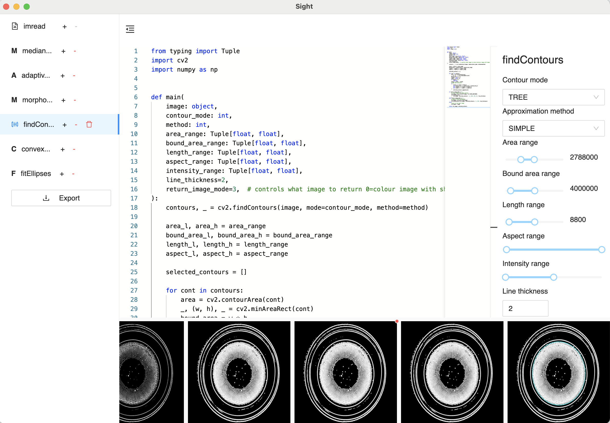
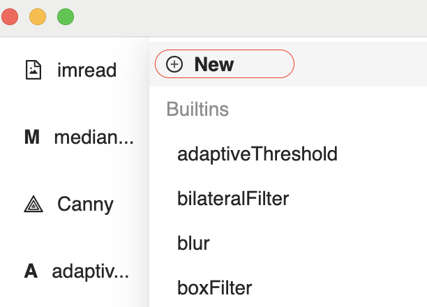

_Sight_ is a Python editor that allows you to see the output of every step of your image processing algorithm.

- Compose image processing algorithms with built-in OpenCV and C2V functions.
- Write custom functions in Python with no restriction.
- Visually adjust algorithm parameters and see results in real time.
- Export to production-ready Python algorithm package.



<!-- TOC -->

- [Using _Sight_](#using-_sight_)
  - [Add a Custom Function](#add-a-custom-function)
  - [Export as a Python Package](#export-as-a-python-package)
- [Developing _Sight_](#developing-_sight_)
  - [Add Builtin Functions](#add-builtin-functions)
  - [Refined Custom Functions](#refined-custom-functions)
- [Build and Distribute Sight](#build-and-distribute-sight)

<!-- /TOC -->

## Using _Sight_

### Add a Custom Function

To create a function hover on the `+` button and select `New`:



A default name (read only) and control panel is provided. You can edit the code of the new function.

A function in Sight is a Python file (module) with a `main` function. The main function takes an image (except `imread`) and optionally other inputs from either the result of a previous function or the control panel (the right panel) in Sight. Every function returns an image and any number of data.

For example, `imread` takes no image but some parameters from the control panel, and returns an image, which has a signature of

```python
# imread.py

def main(filepath: str, flags: int) -> ndarray
```

`Canny` takes an image from the result of a previous function and some parameters from the control panel:

```python
# Canny.py

def main(
    image: ndarray, thresholds: Tuple[int, int], apertureSize: int, L2gradient: bool
) -> ndarray
```

In the most general form, like `fitEllipses`, takes an image, some data (contours) from a previous function, and parameters from the control panel, and returns an image and a list of ellipse:

```python
# fitEllipses.py

def main(
    image: object,
    _contours: List[Contour],
    line_thickness: int,
    return_image_mode=3,
) -> Tuple[object, List[Ellipse]]:
```

As a convention, the input image is always named `image`, inputs from a previous function have a leading underscore `_`, and control panel parameters are named without a underscore and matche the controls' names.

If your function returns extra data apart from an image, a return annotation (e.g. `-> Tuple[object, List[Ellipse]]`) must be provided. This annotation is needed to correctly [`Export`](#export-as-a-python-package) your image processing procedure.

All custom functions are saved in the `resource/vision/custom` folder in the app's root folder on Windows. On macOS it's in `Sight.app/Contents/Resources/vision/custom`.

You can rename the `.py` files to change functions' names but you need to reload Sight (`CMD+r` or `Ctrl+r`) to reflect the changes.

### Export as a Python Package

Add a few functions in the left panel and press the `Export` button to save your image processing algorithm as a Python package. All current steps and control panel parameters are saved.

## Developing _Sight_

### Add Builtin Functions

To create a builtin a function you need to create a `.py` file in [`vision/builtin`](vision/builtin) and a `.tsx` file in [`src/components/ControlPanel`](src/components/ControlPanel). The names of these two file do not need to match but as a good practice the `.tsx` file should have the capitalised name of the `.py` file, e.g. `inRange.py` and `InRange.tsx`. Then add the `.tsx` file to [`src/components/ControlPanel/index.tsx`](src/components/ControlPanel/index.tsx).

```ts
import InRangeControls from './InRange';
...
const controlComponents: { [key: string]: typeof ControlsBase } = {
  inrange: InRangeControls,
  ...
}
```

The key must be the lowercase name of the `.py` file, otherwise it'll fallback to the default control.

### Refined Custom Functions

Builtin functions are read only. To add editable functions with refined control panels, follow the same procedure but put the `.py` files in [`vision/custom`](vision/custom).

## Build and Distribute Sight

Run `yarn package` and find a distributable app in [`release`](release). For more information see [Multi Platform Build](https://www.electron.build/multi-platform-build).
